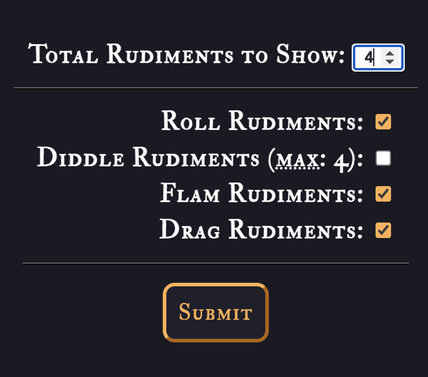
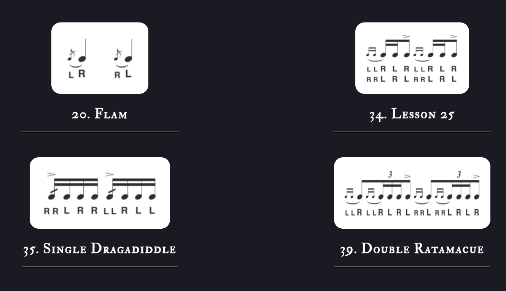

# 40 International Drum Rudiments Generator

**_View this project:_** [https://visionary-sunflower-70af02.netlify.app/](https://visionary-sunflower-70af02.netlify.app/)

## Description and Usage

This application generates a randomized set of rudiments, correctly numbered, from the Percussive Arts Society's codified list of 40 International Drum Rudiments. It may be used as a practice tool or compositional aid for drummers and percussionists.

Simply enter the number of rudiments desired—between one and ten—and check up to four boxes. In producing its randomized selection, the generator will consider only those categories with a check mark.

## Project Previews

- Submit form:

- Example of results:

## Attribution & Drum Education

Musical notation courtesy of the Percussive Arts Society: [https://www.pas.org/resources/rudiments](https://www.pas.org/resources/rudiments)

Download a [pdf of all 40 International Drum Rudiments](https://www.pas.org/docs/default-source/default-document-library/pas-drum-rudiments-2018dcccc96de1726e19ba7fff00008669d1.pdf?sfvrsn=fdbeaea5_6) and start drumming today!
